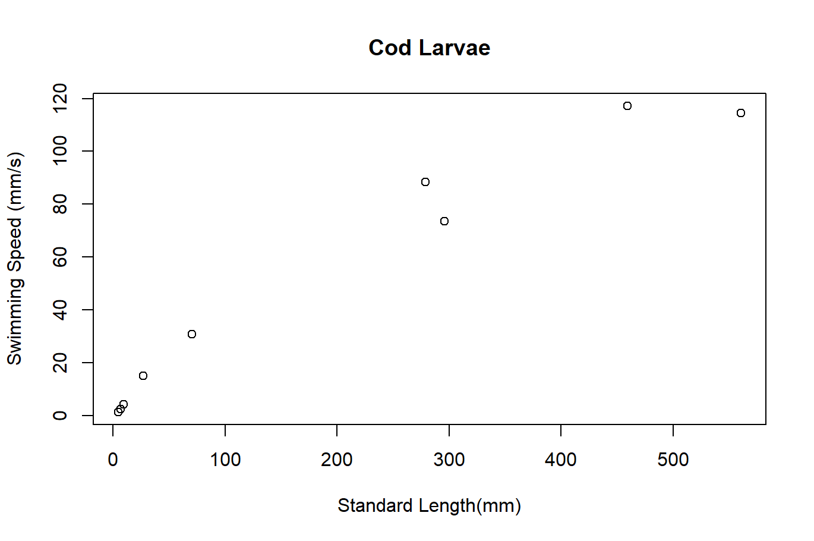

# M.Peck et.al 2006
## Article
Peck, M. A., Buckley, L. J., & Bengtson, D. A. (2006). Effects of temperature and body size on the swimming speed of larval and juvenile Atlantic cod (Gadus morhua): implications for individual-based modelling. Environmental Biology of Fishes, 75(4), 419-429.

## Data
In this article you can find figure 3.A. 
We digitized the data from that figure.
You can Download the .csv file from tthe following link:

<div class="contributor_org">
`r xfun::embed_file(here::here("_dcod", "2022-10-19-Atlantic_Cod_larvae_Swimming_Speed", "Atlantic_Cod_Swimming_Speed_Peck_etal_2006.csv"), text = "Download .csv here")`
</div>

```{r setup, include=FALSE}
knitr::opts_chunk$set(echo = TRUE)
library(tidyverse)
library(astsa)
#https://donsteward.blogspot.com/search/label/boxplots
```

You can also see the figure according to this data set here:

<br>
<center>
{width=70%}
</center>
<br>

# Contact Authors
